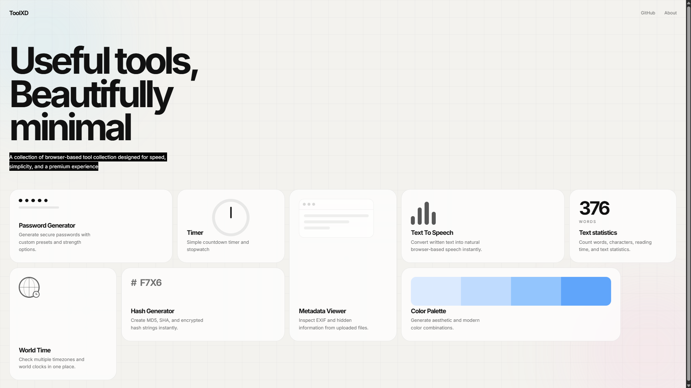
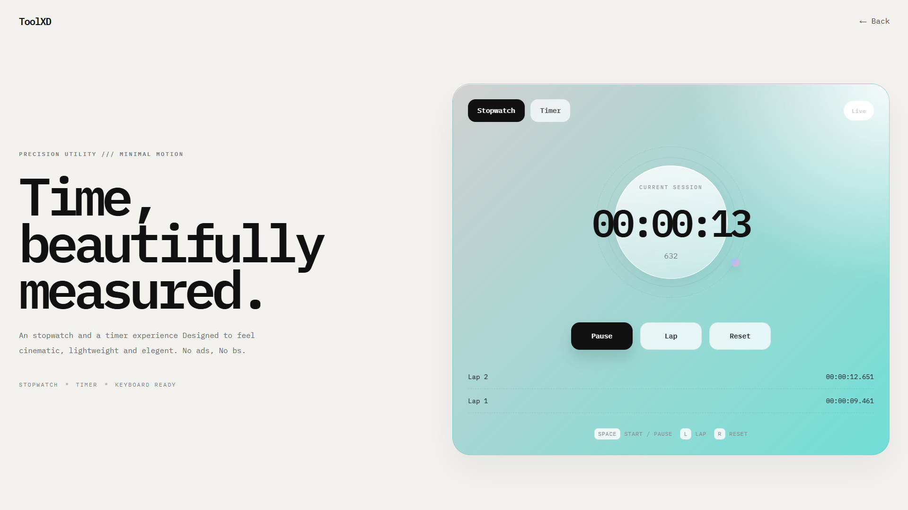

# toolxd

ToolxD is a collection of browser-based utility tools. Designed with a modern interface and a premium ad free visual experience, it is completely adless and really really fast.

Built entirely using vanilla HTML, CSS and JavaScript, most tools work without an internet connection, but some tools, like text to speech, do require it.


## Motivation

Whenever I needed to use a simple tool like world time, a password generator or metadata viewer, 
I usually search the web for it and come across websites providing these services but with lots of 
ads, popups and overall ugly UI/UX making it really difficult to work with it.

So I thought, I could build those tools myself and keep all of them in a single clean webinterface with a consistent style and an ad free premium experience. So I started building ToolxD and adding more and more new tools.

## Live Demo

```text
toolxd.vercel.app
```

or

```text
swaznil.github.io/toolxd
```

---

## Features

- No backend required
- Responsive layout
- Many tools have keyboard shortcuts
- lightweight and fast
- Reusable global CSS

---

## Screenshots 





--- 

## Tech Stack

* HTML
* CSS
* JavaScript
* Browser APIs
* LocalStorage
* Web Speech API

---

## Project Structure
```
toolxd
├── README.md
├── about.html
├── assets
├── css
│   ├── card.css
│   ├── global.css
│   └── style.css
├── index.html
├── js
│   └── script.js
└── tools
    ├── hashgen
    │   ├── hashgen.html
    │   ├── hashgen.css
    │   └── hashgen.js
    ├── metadata
    │   ├── metadata.html
    │   ├── metadata.js
    │   └── metadataview.css
    ├── palette
    │   ├── palette.css
    │   ├── palette.html
    │   └── palette.js
    ├── passwordgen
    │   ├── passwordgen.css
    │   ├── passwordgen.html
    │   └── passwordgen.js
    ├── textstat
    │   ├── textstats.css
    │   ├── textstats.html
    │   └── textstats.js
    ├── timer
    │   ├── timer.css
    │   ├── timer.html
    │   └── timer.js
    ├── tts
    │   ├── tts.css
    │   ├── tts.html
    │   └── tts.js
    └── worldtime
        ├── worldtime.css
        ├── worldtime.html
        └── worldtime.js
```

---

## How It Works

ToolxD is built entirely using vanilla HTML, CSS, and JavaScript. There is no backend. Each tool exists as an independent module with its own HTML, CSS, and JavaScript files.

Almost all tools run inside the browser using Browser APIs and LocalStorage. So these tool work offline after loading. Some tools such as text to Speech, rely on browser provided APIs like the Web Speech API and may require an internet connection depending on browser support. The project also uses reusable global CSS components across all tools.

---

## AI Usage

ChatGPT and Codex were used for: 

I used ChatGPT occasionally to help me with creating initial structure and helping me understand JavaScript logic. I used codex once to find performance improvements and help create global css. All features, design decisios and final integration were implemented by me.

---